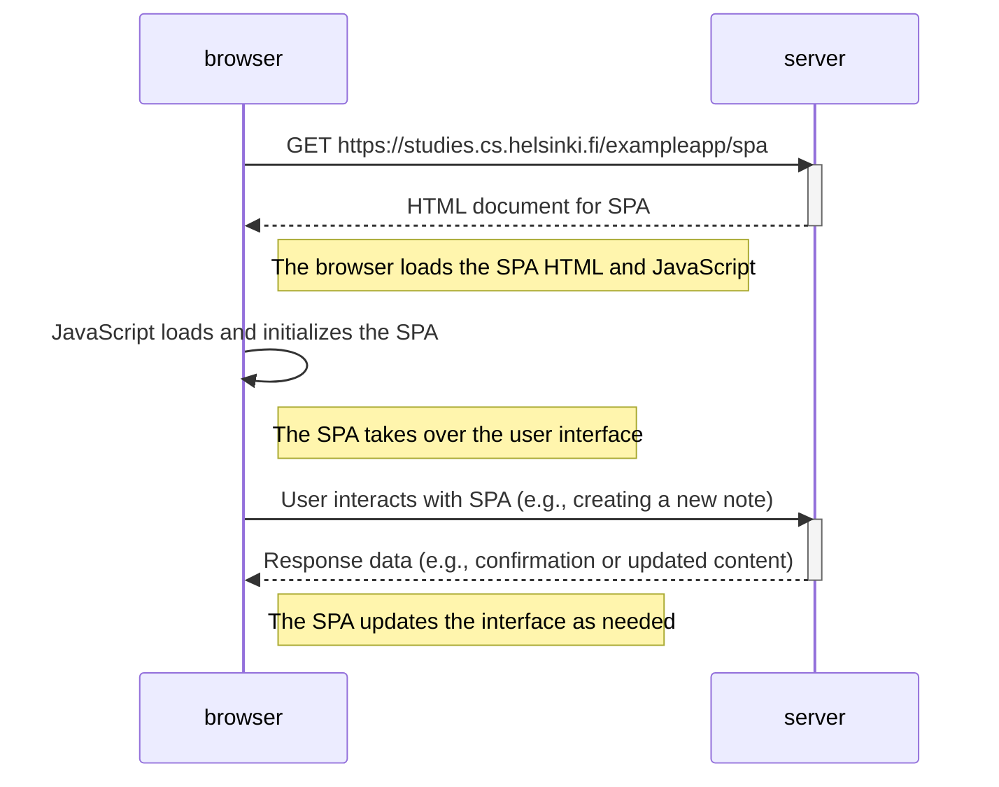

```mermaid
sequenceDiagram
    participant browser
    participant server

    browser->>server: GET https://studies.cs.helsinki.fi/exampleapp/spa
    activate server
    server-->>browser: HTML document for SPA
    deactivate server

    Note right of browser: The browser loads the SPA HTML and JavaScript

    browser->>browser: JavaScript loads and initializes the SPA

    Note right of browser: The SPA takes over the user interface

    browser->>server: User interacts with SPA (e.g., creating a new note)
    activate server
    server-->>browser: Response data (e.g., confirmation or updated content)
    deactivate server

    Note right of browser: The SPA updates the interface as needed

```
