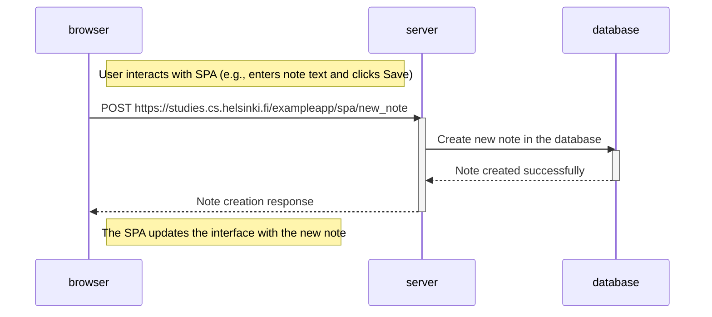

```mermaid
sequenceDiagram
    participant browser
    participant server
    participant database

    Note right of browser: User interacts with SPA (e.g., enters note text and clicks Save)

    browser->>server: POST https://studies.cs.helsinki.fi/exampleapp/spa/new_note
    activate server
    server->>database: Create new note in the database
    activate database
    database-->>server: Note created successfully
    deactivate database
    server-->>browser: Note creation response
    deactivate server

    Note right of browser: The SPA updates the interface with the new note
```
