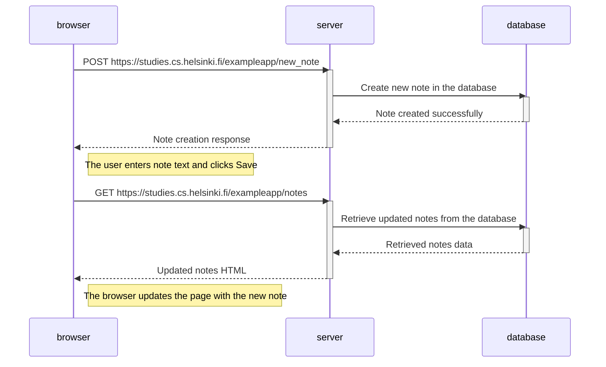

```mermaid
sequenceDiagram
    participant browser
    participant server
    participant database

    browser->>server: POST https://studies.cs.helsinki.fi/exampleapp/new_note
    activate server
    server->>database: Create new note in the database
    activate database
    database-->>server: Note created successfully
    deactivate database
    server-->>browser: Note creation response
    deactivate server

    Note right of browser: The user enters note text and clicks Save

    browser->>server: GET https://studies.cs.helsinki.fi/exampleapp/notes
    activate server
    server->>database: Retrieve updated notes from the database
    activate database
    database-->>server: Retrieved notes data
    deactivate database
    server-->>browser: Updated notes HTML
    deactivate server

    Note right of browser: The browser updates the page with the new note

```
